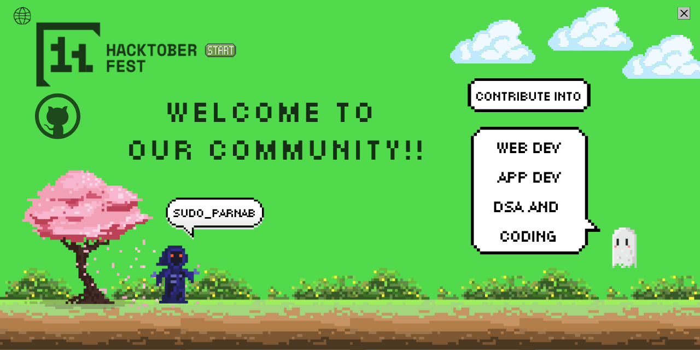

# **It's Algober: Your Hacktoberfest Starter Pack**

> Tap the banner to know more about Hacktoberfest 2024.

  
   
   

### Hey there, future programmer! 👨‍💻

Welcome to our community! Whether you're a seasoned programmer, a dedicated DSA enthusiast, or just starting your journey, we're glad you're here.

**Don't worry if you're new to open source.** Everyone starts somewhere! We're here to support and guide you every step of the way. 

>  **Join our [Its Hacktober WhatsApp Group](https://chat.whatsapp.com/HfqDn52yy6l8T2d6fL0hKU) for more updates.**</a>

### **How to Get Started:**

1. **Star this repository, By starring, you can keep track of its progress and updates.**
   
2. **Add Your Algorithm/Code:** Contribute a new code addressing all programmers need. Follow the detailed instructions outlined in our [CONTRIBUTING.md](CONTRIBUTING.md) to ensure your project aligns with our guidelines.

3. **Improve Existing Algorithm/Codes:**  Browse the repository and find an existing code you'd like to contribute to. Check the project's specific instructions or open issues to understand current needs. Remember to follow the general contribution guidelines documented in [CONTRIBUTING.md](CONTRIBUTING.md).

4. **Once you've made your changes, submit a pull request and let us review your work.**

## **Contributions are welcome in all areas of data structures and algorithms, including:**

* **Fundamental data structures:** Implement and analyze fundamental data structures like arrays, linked lists, stacks, queues, trees, graphs, and hash tables.
* **Sorting and searching algorithms:** Develop efficient algorithms for sorting and searching data, such as quicksort, mergesort, bubble sort, binary search, and linear search.
* **Dynamic programming:** Solve complex problems by breaking them down into smaller subproblems and using memoization or tabulation to avoid redundant calculations.
* **Greedy algorithms:** Design algorithms that make locally optimal choices at each step, hoping to achieve a globally optimal solution.
* **Divide-and-conquer algorithms:** Divide problems into smaller, similar subproblems, solve the subproblems recursively, and combine the solutions to solve the original problem.
* **Graph algorithms:** Explore algorithms for traversing graphs, finding shortest paths, detecting cycles, and solving problems related to networks and relationships.
* **Advanced data structures:** Implement and analyze more advanced data structures like tries, heaps, segment trees, and Fenwick trees.
* **Competitive programming:** Practice solving algorithmic problems under time constraints and improve your problem-solving skills.

**We encourage contributions from developers at all levels of experience, regardless of background or skillset.** Your unique perspective and contributions can make a valuable impact on our projects.

### **Encountering Issues?**

If you're facing any problems, ask on [Its Hacktober WhatsApp Group](https://chat.whatsapp.com/HfqDn52yy6l8T2d6fL0hKU)

Our community is here to help! Feel free to ask questions, seek advice, or collaborate on solutions.

**Let's have some fun and learn together!** 🎉
